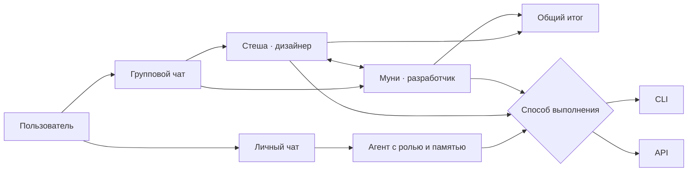

<div align="center">

# Third Hand

**Личная команда ИИ-агентов в одном нативном окне macOS.**

Создавайте агентов с именами и ролями, общайтесь с ними один на один или собирайте в групповые чаты, где они обсуждают задачу друг с другом и возвращают вам общий итог.

`SwiftUI` · `macOS 14+` · `CLI + API` · `Local-first`

</div>

---

## Что это

Third Hand превращает разрозненные ИИ-инструменты в понятную команду.

Вместо безымянного переключателя моделей здесь живут **агенты**: у каждого есть имя, аватар, характер, специализация, отдельная история общения и свой способ выполнения — локальный CLI или выбранная модель по API.

Например, можно создать **Стешу-дизайнера** и **Муни-разработчика**, добавить их в один чат и написать:

> Стеша, обсуди с Муни идею приложения и решите, подойдёт ли розовый цвет для интерфейса.

Third Hand распознает имена без символа `@`, даст агентам несколько реплик, покажет их аргументы по очереди, а затем сформулирует для вас итог: о чём они договорились, какие разногласия остались и что предлагают делать дальше.

## Зачем

Сегодня один ИИ живёт в терминале, другой — в подписке, третий — за API-ключом. Их лимиты заканчиваются в разное время, контекст теряется при переключении, а пользователю приходится вручную переносить историю между окнами.

Third Hand собирает это в один рабочий процесс:

- **ИИ становится командой.** Агент — это не только модель, а постоянная роль и характер общения.
- **Нет привязки к одному провайдеру.** Можно использовать существующие CLI-подписки, работать только через API или сочетать оба варианта.
- **Контекст переживает переключение.** Handoff передаёт следующему исполнителю компактное состояние разговора или задачи.
- **Работа остаётся наблюдаемой.** Видно, кто отвечает, через какой CLI или API, что происходит с репозиторием и к какому решению пришла группа.

## Как устроен разговор



## Основные возможности

### Персональные агенты

- имя, аватар, цвет, характер и собственные инструкции;
- сценарии «Общение», «Проект» и автоматический выбор;
- отдельная история чата и рабочая папка;
- фиксированный исполнитель или автоматический маршрут;
- понятная метка источника каждого ответа: `CLI` или `API`.

### Групповые чаты

- два и более агента в одной беседе;
- общий контекст: участники знают состав группы и видят реплики друг друга;
- обращение по обычным именам без `@`;
- обсуждение с аргументами, уточнениями и возражениями между агентами;
- автоматический итог для пользователя после разговора;
- возможность остановить обсуждение и изменить состав группы.

### CLI и API на равных

Third Hand поддерживает два независимых способа работы:

| Режим | Для чего подходит |
| --- | --- |
| **CLI** | Использовать установленные Codex CLI, Claude Code и Antigravity, включая доступ по существующим подпискам. |
| **API** | Работать без CLI и подписки через OpenAI, Anthropic, Google Gemini или OpenRouter. |
| **Auto** | Начать с доступного CLI и при подтверждённом исчерпании лимита продолжить через следующий CLI или настроенный API. |

Для каждого API можно сохранить отдельный ключ, загрузить доступный каталог моделей и выбрать основную модель. Агенту можно назначить конкретный CLI или конкретную API-модель. Отдельная модель выбирается для Handoff.

API-ключи хранятся в **macOS Keychain** и не записываются в файл состояния приложения.

### Handoff без потери смысла

При переключении между исполнителями Third Hand передаёт не сырой бесконечный transcript, а компактный контекст: цель, важные решения, открытые вопросы и текущее состояние. Handoff работает между CLI и API в обе стороны.

### Работа с проектами

- выбор Git-репозитория и папки по умолчанию;
- живая индикация выполнения CLI и возможность остановки;
- Git snapshot, список изменений, diff stat и read-only просмотр diff;
- вложения, спецификация задачи, этапы и checkpoints;
- build/test recipes для SwiftPM, npm, Gradle и Python;
- блокировка параллельной записи в один репозиторий;
- уведомления о вопросах, ошибках и завершении.

### Нативное приложение для macOS

- интерфейс на SwiftUI с sidebar, чатом и inspector;
- светлая, тёмная и системная темы;
- выбор языка, параметры доступности и сочетания клавиш;
- голосовой ввод;
- локальное сохранение агентов, групп и истории;
- безопасная резервная копия состояния.

## Приватность

Third Hand спроектирован как local-first приложение:

- профили, чаты и состояние хранятся локально на Mac;
- API-ключи находятся в Keychain;
- API получает только подготовленные инструкции и контекст выбранного разговора или задачи;
- API-модель не получает прямого доступа к терминалу и файловой системе;
- raw terminal logs скрыты, пока пользователь явно не откроет их;
- удаление агента или чата не удаляет связанный репозиторий.

При использовании внешнего API данные запроса обрабатываются выбранным провайдером согласно его условиям и политике конфиденциальности.

## Текущий статус

Third Hand активно развивается. Уже работает основной сценарий персональных и групповых чатов, выполнение через CLI и API, автоматическое переключение и проектный Git-контекст. Это ранняя версия: перед использованием с важными репозиториями проверяйте изменения и результаты команд.

Продолжительная интерактивная TUI-сессия, managed worktrees, независимый background runner и восстановление активного процесса после полного Quit остаются следующими архитектурными этапами.

## Запуск из исходников

Понадобятся macOS 14 или новее и Xcode со Swift 6.1 или новее.

```bash
git clone https://github.com/MoonbayStudio/thirdhand.git
cd thirdhand
./script/build_and_run.sh
```

Сборка приложения появится в `dist/Third Hand.app`.

Чтобы дополнительно проверить, что процесс успешно запустился:

```bash
./script/build_and_run.sh --verify
```

CLI-провайдеры и API-ключи необязательны для запуска интерфейса, но для ответов агентов должен быть доступен хотя бы один исполнитель.

## Тесты

```bash
swift test
```

## Документация

- [Архитектура Third Hand](RFC-001-architecture.md)
- [Apache License 2.0](LICENSE)
